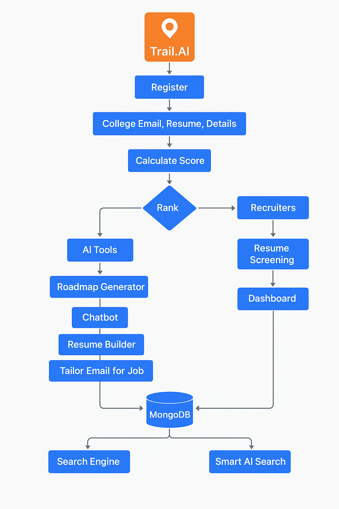

# Trail.AI 🚀  
*Automating Job Search and Recruitment with Smart AI Tools*



## 🔍 About the Project

**Trail.AI** is an AI-powered platform that simplifies and automates job searching for students and recruitment for companies. It offers powerful AI tools to students while giving recruiters intelligent candidate filtering and search functionalities.

> "ChatGPT can do all this with a good prompt, but our aim is to automate the process."

---

## 🎯 Features

### 🧑‍🎓 For Students:
- Register using your official college email.
- Upload resume and get an ATS-based score.
- Get ranked in a leaderboard with access to AI career tools:
  - 📄 Resume Builder (with LaTeX support)
  - 🧭 Roadmap Generator
  - 💬 Career Guidance Chatbot
  - 🧠 Career Path Generator
  - ✉️ Email Tailoring Tool for job outreach

### 🧑‍💼 For Recruiters:
- Resume screening dashboard.
- Search Engine powered by **ChromaDB**.
- Toggle “Smart AI Search” to find best candidates using LLMs.
- AI-generated candidate insights and ATS scoring.

---

## 🛠️ Tech Stack

| Area         | Tech Used |
|--------------|-----------|
| Frontend     | HTML, CSS, JavaScript |
| Backend      | Flask, Docker |
| Database     | MongoDB |
| AI/ML        | PyTorch, Scikit-learn, Pandas |
| LLM & NLP    | Hugging Face Transformers, Gemini, LangChain |
| Vector Store | ChromaDB |

---

## 📊 Architecture & Flow

The system architecture includes separate components for:
- Data intake (resume uploads, user profiles)
- Resume parsing & scoring
- LLM-based tools and interaction
- Recruiter dashboards and AI search

See the flow diagram above for an overview of the full pipeline.

---

## 📦 How to Run Locally

```bash
git clone https://github.com/mv35011/Trail.AI_project.git
cd trail.ai
pip install -r requirements.txt
python run.py
